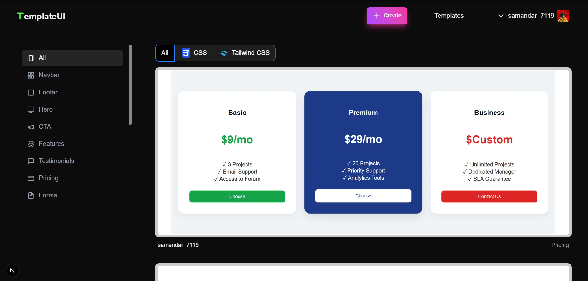
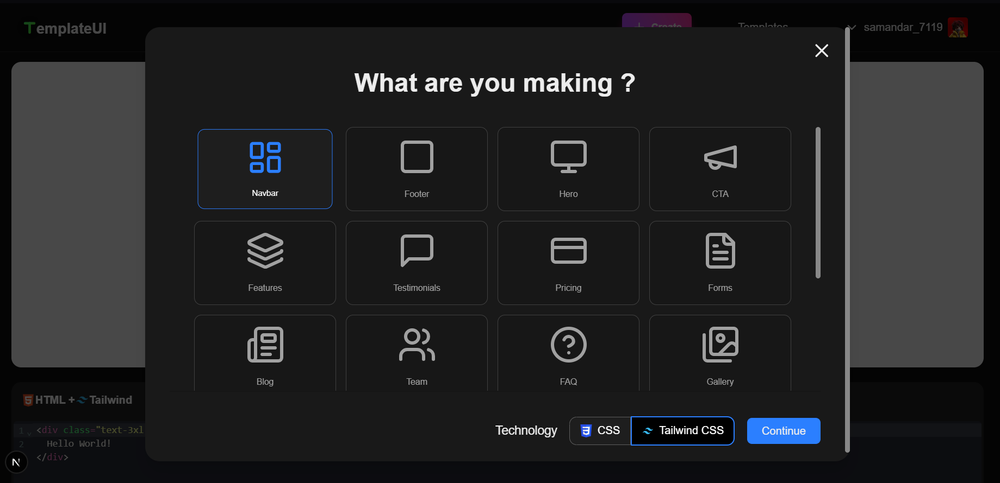
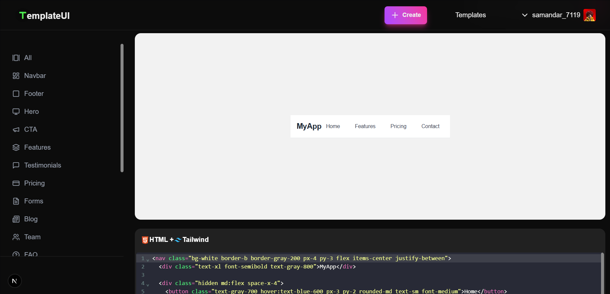
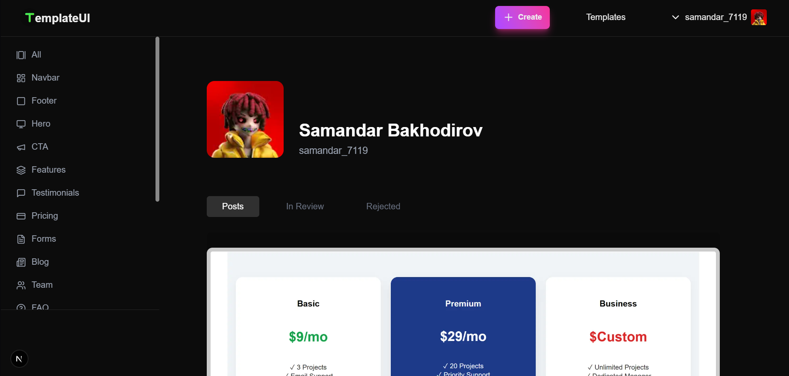

# 🚀 TemplateUI — UI Template Publishing Platform

**TemplateUI** is a web platform where developers can **publish** and **browse** UI components like navbars, hero sections, footers, and more.

Built with **Next.js 15**, **Prisma**, **TailwindCSS**, and **MySQL**.

---

## 🧩 Features

- 🔼 **Publish your own UI templates** (title, type, code snippet)
- 🌐 **Explore templates** published by other developers
- 🛠 **API Routes** using Next.js App Router (app/api)
- 📦 Integrated with MySQL using Prisma ORM

---

## 🖼️ UI Preview

### 📂 Template Page
Displays a list of all published templates.



---

### 📤 Upload Page
Form to publish a new template with title, type (navbar, footer, etc.), and HTML/CSS & Tailwind CSS code.



---

### 👀 Template Detail Page
View full template info, codes and author profile.



---

### 👤 Profile Page
Displays author’s nickname, avatar, and their published templates.  



---

## 📚 Tech Stack


| Tech         | Description                          |
|--------------|--------------------------------------|
| Next.js 15   | React-based full-stack framework     |
| TypeScript   | Type-safe JavaScript                 |
| TailwindCSS  | Utility-first CSS framework          |
| GSAP         | Smooth UI animations and transitions |
| Prisma ORM   | Type-safe database toolkit           |
| MySQL        | Relational database                  |
| Railway      | (Optional) Cloud deployment          |


---

## 🚀 Getting Started Locally

```bash
# 1. Clone the repository
git clone https://github.com/samlovv/template-website.git

# 2. Install dependencies
cd template-website
npm install

# 3. Set up .env file
cp .env.example .env
# Add your DATABASE_URL, PUBLIC_API_URL, etc.

# 4. Push database schema
npx prisma db push

# 5. Run the development server
npm run dev
