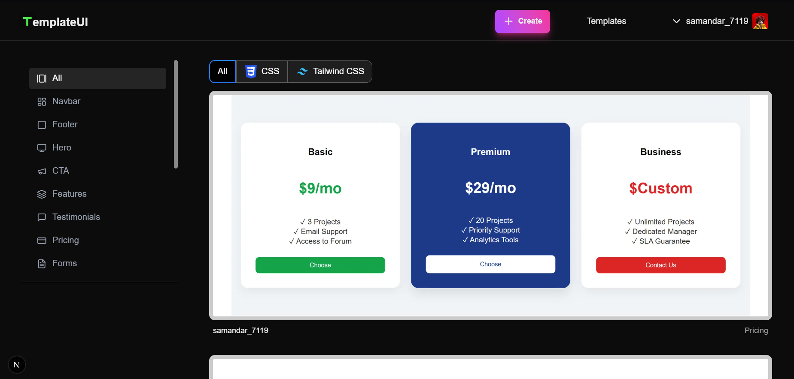
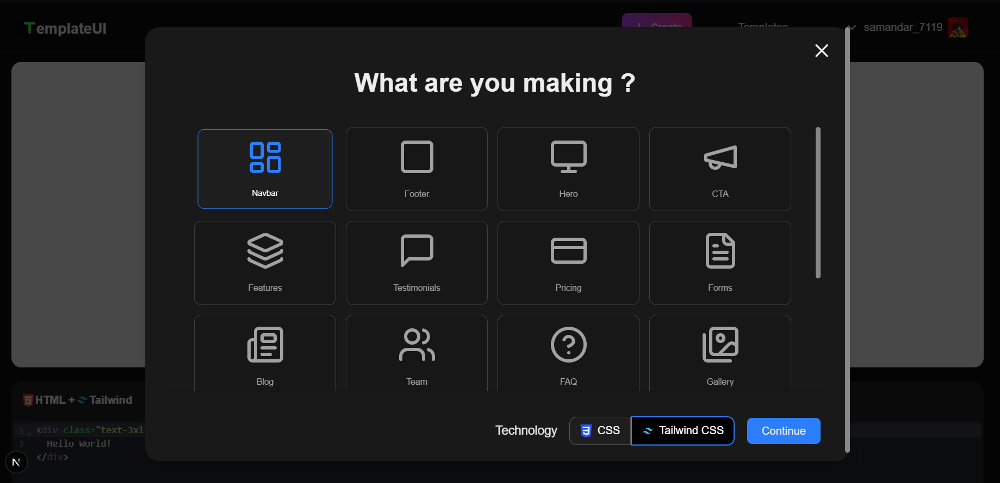
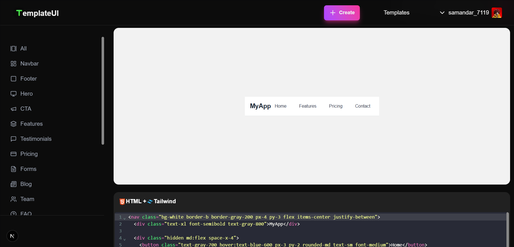
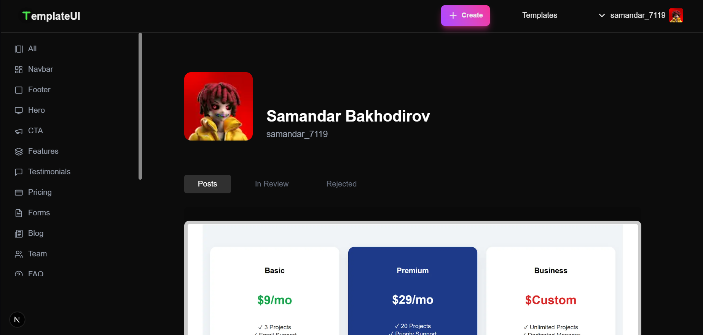
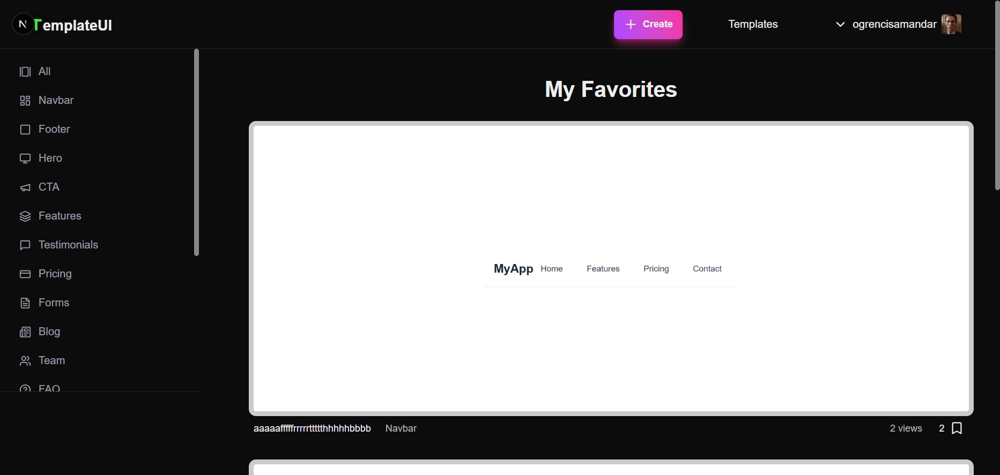

# 🚀 TemplateUI — UI Template Publishing Platform

**TemplateUI** is a modern web platform where developers can **publish**, **browse**, and **view** ready-to-use UI components — such as navbars, hero sections, footers, and more.

🌐 **Live Demo:** [templateui.up.railway.app](https://templateui.up.railway.app)

---

## 🧩 Features

- 🔼 **Publish UI templates** with a title, type (e.g., navbar, footer), and code
- 🌐 **Explore templates** published by other developers
- 👀 **Detailed view** for each template with code and author info
- 👤 **User profiles** displaying their published templates
- 🛠 **API routes** via Next.js App Router (`app/api`)
- 💾 **Database integration** with Prisma ORM & MySQL

---

## 🖼️ UI Preview

### 📂 Templates Page
Browse all published UI templates  


### 📤 Upload Page
Publish a new template using a form  


### 👀 Template Detail Page
View full code, author, and template type  


### 👤 Profile Page  
Shows user avatar, nickname, and their published templates  


### ❤️ Favorite Templates Page
Shows all templates saved by user

---

## 🧪 Tech Stack

| Tech         | Description                          |
|--------------|--------------------------------------|
| **Next.js 15**   | Full-stack React framework         |
| **TypeScript**   | Strongly typed JavaScript          |
| **TailwindCSS**  | Utility-first CSS framework        |
| **GSAP**         | Smooth UI animations               |
| **Prisma ORM**   | Type-safe database toolkit         |
| **MySQL**        | Relational database                |
| **Railway**      | Cloud hosting                      |

---

## 🚀 Getting Started Locally

```bash
# 1. Clone the repository
git clone https://github.com/samlovv/template-website.git

# 2. Install dependencies
cd template-website
npm install

# 3. Configure environment variables
cp .env.example .env
# Add your DATABASE_URL, NEXTAUTH_SECRET, etc.

# 4. Push Prisma schema to the database
npx prisma db push

# 5. Run the development server
npm run dev
